# Garage Manager
> A desktop application for managing garage.

## Table of contents
* [General info](#general-info)
* [Screenshots](#screenshots)
* [Technologies](#technologies)
* [Status](#status)

## General info
Garage Manager is a desktop application designed to manage garage. It was created with WPF technology and MVVM pattern.
Application lets you performing typical CRUD operations for users, customers, cars and services. 
Application stores data in SQL Server database and uses EF Core to manage entities. 
The model of application was created with Code-First approach which supports migrations. 
Between the data and the services layer there are services which are responsible for performing CRUD operations on database via context. 
The UI project is based on view models and views. There is a one view model for each view. 
Views present data to the user by use of data binding between WPF controls and properties of view models. 
The whole application logic responsible for navigating between different views or calling services methods was encapsulated in commands. 
UI uses Dependency Injection (implemented with IHostBuilder) to provide view models with services and other dependencies.

## Screenshots
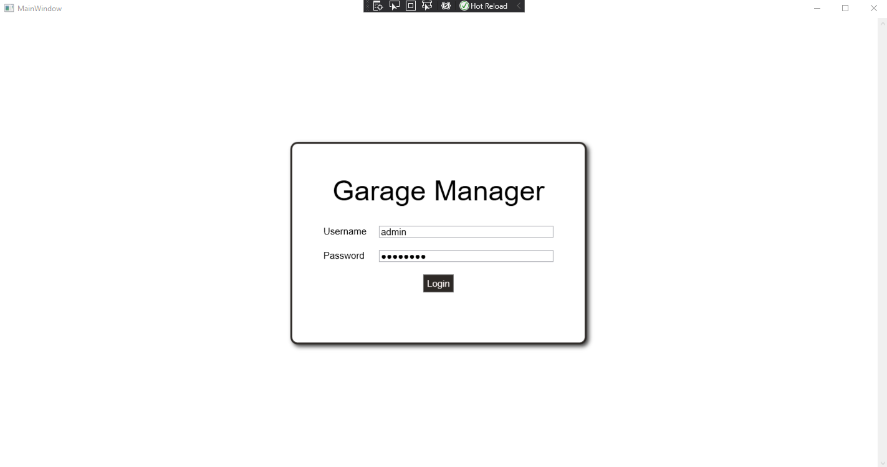
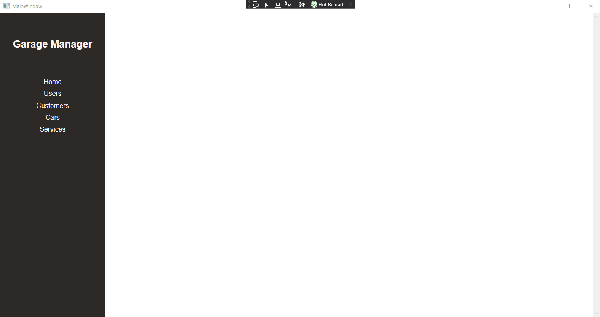
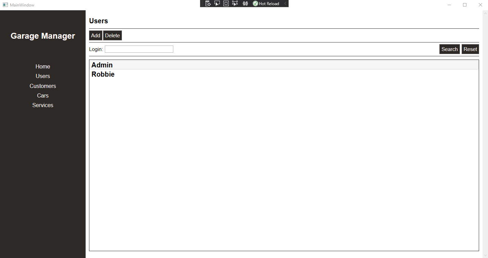
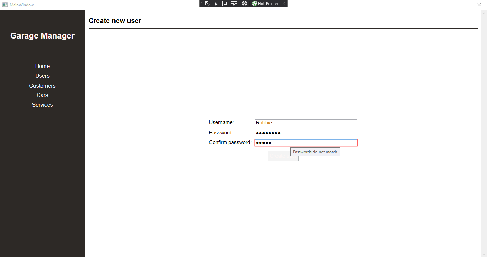
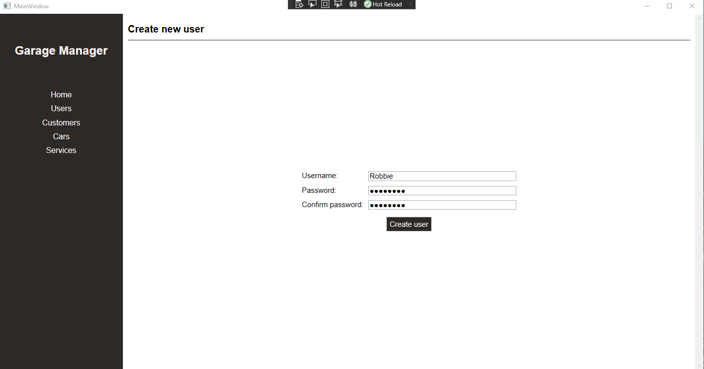
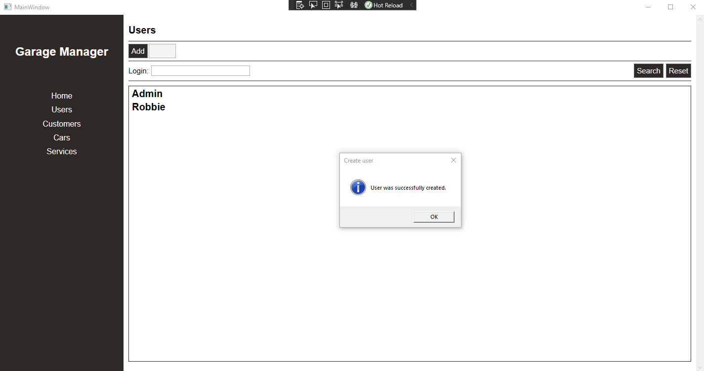
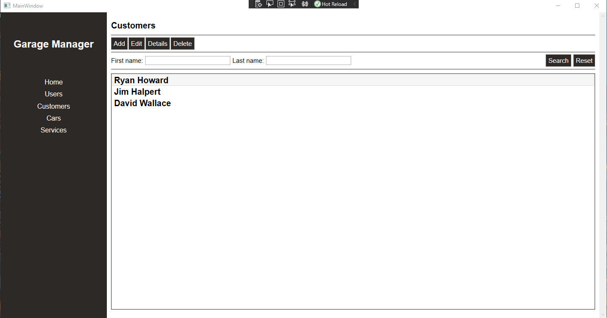
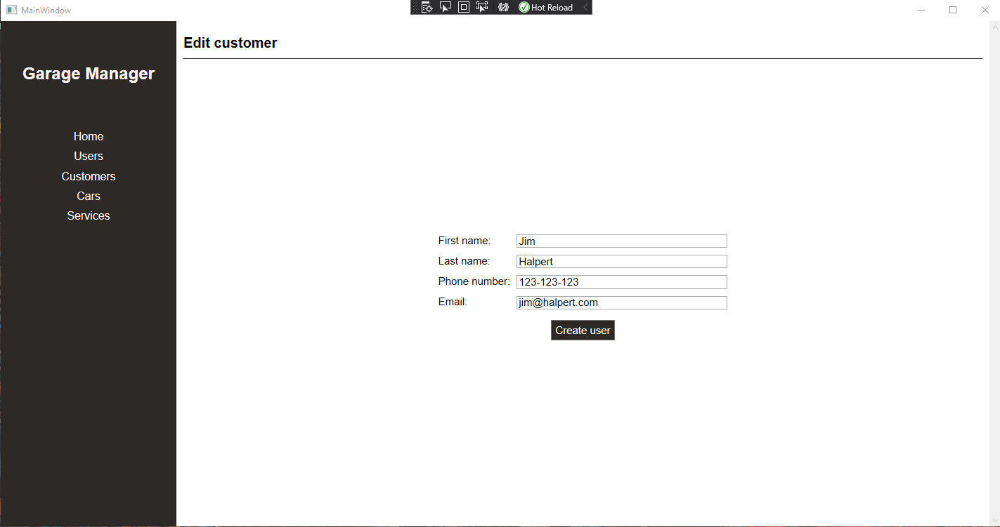
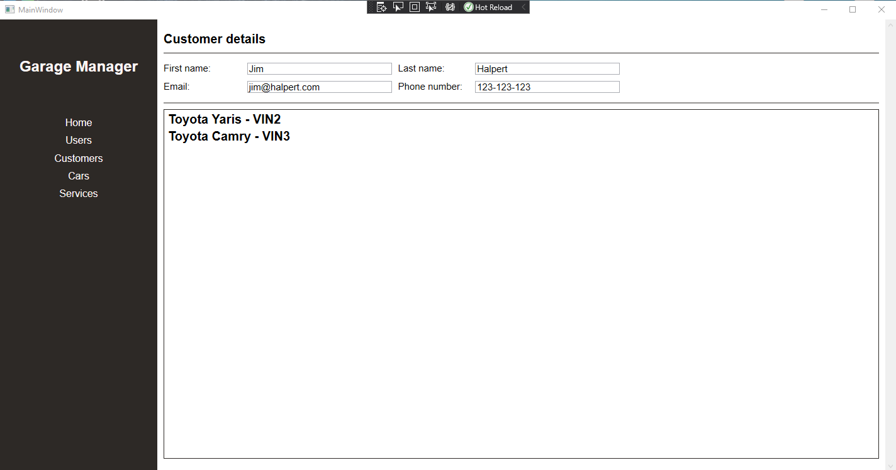
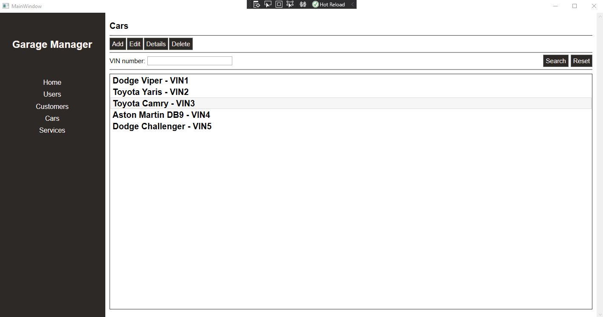
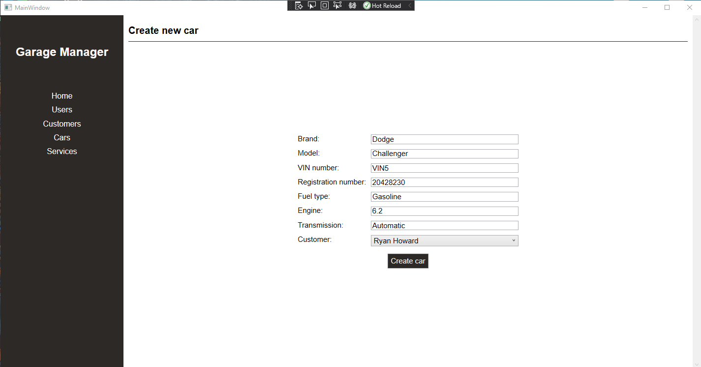
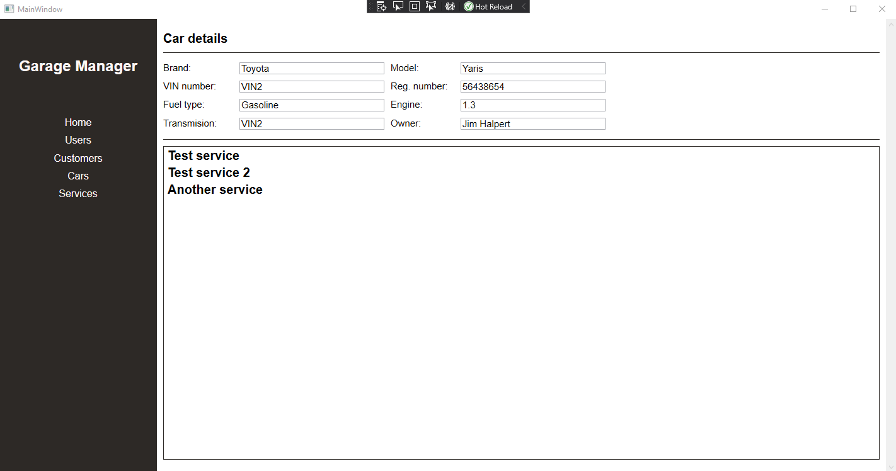
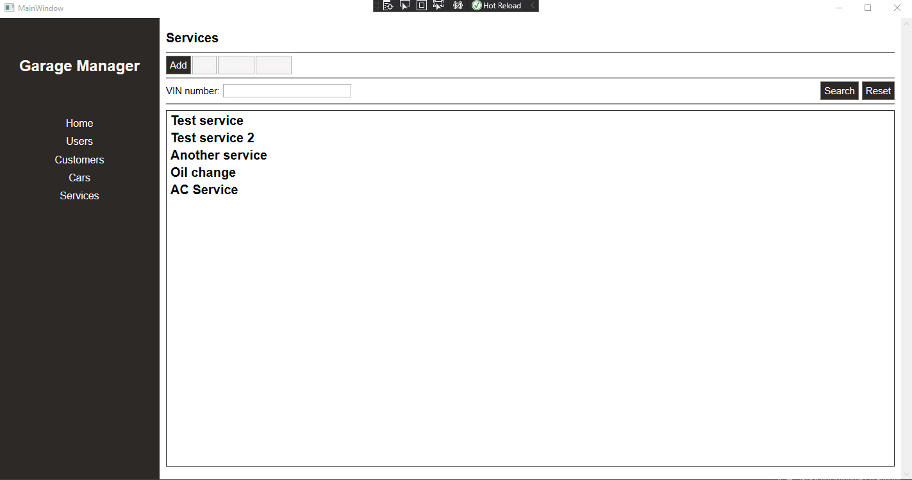
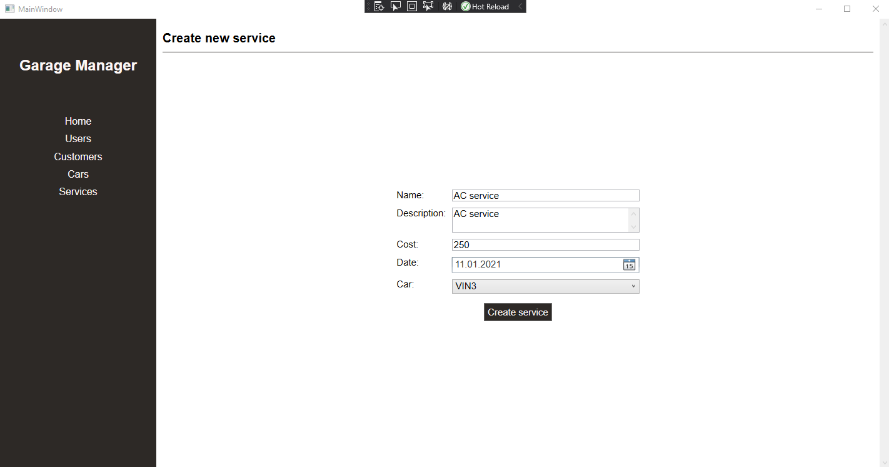
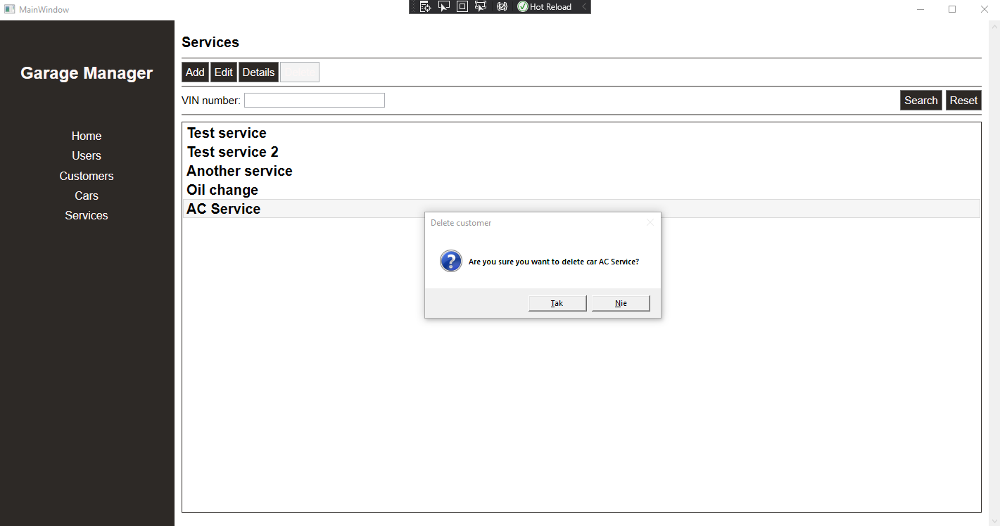
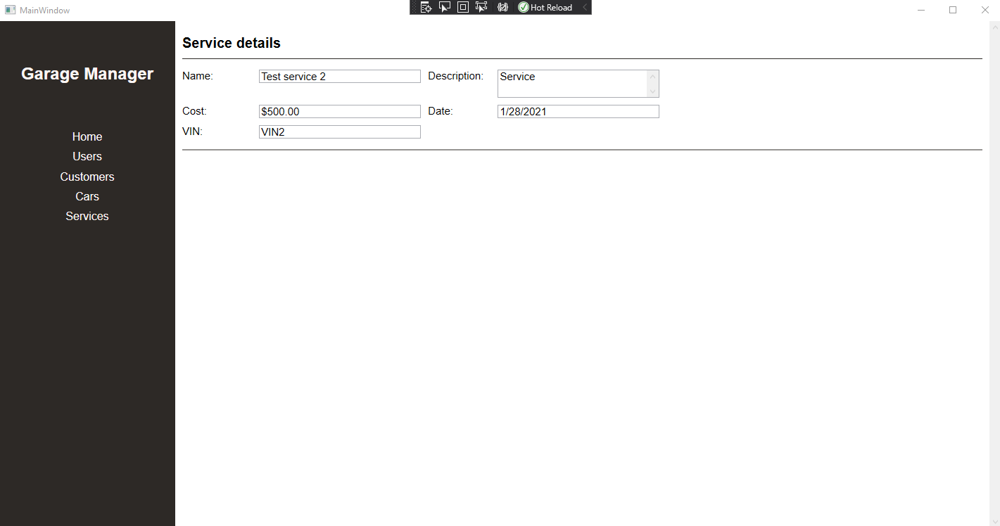

## Technologies
* .NET 5
* Entity Framework Core
* PasswordBoxMVVM by Singleton Sean (bindable password text input)

## Status
There are a few things that could be done like global styles for UI elements or separated view and view model for navigation sidebar but they don’t affect the main functionality of application.
Project is finished at the moment.   
